# 🏢 Mumbai Metropolitan Real Estate RAG Assistant

An enterprise-grade Retrieval-Augmented Generation (RAG) conversational agent specialized in the **Mumbai Metropolitan Region (MMR)** real estate markets. Built using **LangChain**, **FastAPI**, **Streamlit**, and **ChromaDB**, it implements double-level metadata filtering (Zone & Locality) for highly specific, hallucination-free localized analytics.

---

<p align="center">
  
  
  
  
  
</p>

---

## 🏗️ System Architecture

The chatbot utilizes semantic search coupled with strict metadata filtering on the vector index level to query local real estate knowledge documents.

```mermaid
graph TD
    User[User Client] -->|1. Query + Filters| UI[App Interface: Web / Streamlit]
    UI -->|2. Retrieve Chunks with Explicit Metadata Filter| DB[(ChromaDB Vector Store)]
    DB -->|3. Matched Document Chunks| Chain[RetrievalQA Chain]
    Chain -->|4. Prompt + Context Injection| LLM[LLM Engine: OpenAI GPT-4o-mini / Ollama Llama3]
    LLM -->|5. Structured Answer| Chain
    Chain -->|6. Format Answer & Cited Sources| UI
    UI -->|7. Render Chat Bubbles & Source Tags| User

    style DB fill:#1e293b,stroke:#3b82f6,stroke-width:2px;
    style LLM fill:#1e293b,stroke:#10b981,stroke-width:2px;
    style UI fill:#0f172a,stroke:#8b5cf6,stroke-width:2px;
```



---

## 🗺️ Region & Zone Index Coverage

The knowledge base compiles comprehensive regional market briefs, covering connectivity infrastructure (Metro lines, Coastal Road, MTHL), key developer projects, pricing brackets, and upcoming growth catalysts.

| Zone | Primary Localities Covered | RAG Metadata Filter |
| :--- | :--- | :--- |
| **Central Eastern Suburbs** | Kanjurmarg, Bhandup, Mulund, Vikhroli, Nahur | `locality: [locality_name]` |
| **Central Mumbai** | Dadar, Kurla, Ghatkopar, Chembur, Govandi, Mankhurd, Tilak Nagar | `locality: [locality_name]` |
| **Western Mumbai** | Andheri, Borivali, Kandivali, Malad, Goregaon, Dahisar, Mira Road, Bhayandar | `locality: [locality_name]` |
| **South & Harbour Mumbai** | Bandra, Worli, Lower Parel, Parel, Wadala, Sion, Matunga, Mahim | `locality: [locality_name]` |
| **Thane District** | Thane West, Thane East, Kalyan, Dombivli, Ulhasnagar, Bhiwandi, Ambernath, Badlapur | `locality: [locality_name]` |
| **Navi Mumbai** | Vashi, Kharghar, Panvel, Airoli, Nerul, Belapur, Sanpada, Ghansoli, Kopar Khairane | `locality: [locality_name]` |

---

## 🛠️ Core Capabilities

- **Dual-Mode Inference**:
  - *Cloud Inference*: Uses OpenAI `text-embedding-3-small` and `gpt-4o-mini` if `OPENAI_API_KEY` is present.
  - *Local/Offline Inference*: Fallback to HuggingFace `sentence-transformers/all-MiniLM-L6-v2` and local **Ollama** running `llama3`.
- **Explicit Operator Metadata Querying**: Implements strict vector indexing filters (`$eq` for specific localities and `$in` for full-zone queries) to guarantee zero-context hallucinations.
- **Browser-Side Chat Session History**: Local storage integration ensures the chat session persists between refreshes.

---

## 📂 Project Structure

```
.
├── data/
│   └── locality_briefs/      # Regional real estate markdown files
├── chroma_db_openai/         # Chroma DB storage for OpenAI embeddings (1536 dim)
├── chroma_db_local/          # Chroma DB storage for HuggingFace embeddings (384 dim)
├── frontend/                 # Static frontend files for FastAPI server
│   ├── index.html            # Web interface layout
│   ├── style.css             # Glassmorphic visual theme
│   └── app.js                # Local storage history and API connectors
├── app.py                    # Streamlit Dashboard application
├── server.py                 # FastAPI Web Server backend
├── ingest.py                 # Indexing and database creation script
├── requirements.txt          # Python dependencies
└── .env                      # Credentials file (git-ignored)
```

---

## 🚀 Setup & Execution

### 1. Installation
Install project dependencies:
```bash
pip install -r requirements.txt
```

### 2. Configure Credentials (Optional)
Create a `.env` file at the root directory and add your key for Cloud Mode:
```env
OPENAI_API_KEY=your_openai_api_key_here
```
*If left empty, the application runs fully locally using Ollama Llama-3.*

### 3. Database Ingestion
Index the locality briefs into the vector database:
```bash
python ingest.py
```

---

## 🖥️ Choose Your UI Client

You can run either client interface depending on your requirements:

### **Interface A: FastAPI Web Application (Recommended)**
A fast HTML5/CSS3/JS single-page application, featuring persistent chat history and optimized pre-cached retrieval speeds.
- **Run Server**:
  ```bash
  python server.py
  ```
- **Access Link**: [http://localhost:8000](http://localhost:8000)

### **Interface B: Streamlit Dashboard**
A Python-driven dashboard styled with custom CSS overrides, glassmorphism, and active engine indicators.
- **Run Server**:
  ```bash
  streamlit run app.py
  ```
- **Access Link**: [http://localhost:8501](http://localhost:8501)
