# 🏢 Mumbai Metropolitan Real Estate RAG Assistant

An enterprise-grade Retrieval-Augmented Generation (RAG) conversational agent specialized in the **Mumbai Metropolitan Region (MMR)** real estate markets. Built using **LangChain**, **FastAPI**, **Streamlit**, and **ChromaDB**, it implements double-level metadata filtering (Zone & Locality) to provide highly specific, grounded, and hallucination-free localized market intelligence.

🚀 **Live Space Demo**: **[hunter1508-realestateagent.hf.space](https://hunter1508-realestateagent.hf.space)**

---

<p align="center">
  
  
  
  
  
  <a href="https://hunter1508-realestateagent.hf.space" target="_blank">
    
  </a>
</p>

---

## ✨ Features & Core Capabilities

*   **🔒 Zero-Context Hallucination Prevention**: Implements strict metadata filtering at the database vector index level (rather than in the LLM prompt) ensuring the model only answers based on verified locality briefs.
*   **⚡ Sub-Second Latency (Cached Startup)**: Global resources—including local Sentence-Transformer embeddings, OpenAI Embeddings, and Chroma DB instances—are preloaded into memory once at server startup, slashing request latency from ~8s to under 1s.
*   **🔄 Dual-Mode Hybrid Execution**:
    *   **Cloud Mode**: Uses OpenAI `text-embedding-3-small` and `gpt-4o-mini` if an API key is provided.
    *   **Offline Mode**: Falls back to local Hugging Face `all-MiniLM-L6-v2` and local **Ollama** running `llama3` for 100% private execution.
*   **🛠️ Auto-Ingestion Fallback**: If hosted in the cloud and an `OPENAI_API_KEY` is added, the server automatically detects missing vector indices and builds them on the fly at startup in under 3 seconds.
*   **🎨 Premium Glassmorphic UI/UX**: Includes an attractive CSS single-page interface with real-time connectivity status indicators, quick-fill suggestion chips, and responsive columns.
*   **💾 Local Storage Chat History**: Session messages are stored on the browser side, keeping your conversation intact during page refreshes.

---

## 🏗️ System Architecture & RAG Pipeline

```mermaid
graph TD
    User[User Client] -->|1. Query + Zone/Locality Filters| UI[App Interface: HTML5 or Streamlit]
    UI -->|2. HTTP POST Request| API[FastAPI Server]
    API -->|3. Apply Explicit Metadata Filter| DB[(ChromaDB Vector Store)]
    DB -->|4. Retrieve Context Chunks| Chain[RetrievalQA Chain]
    Chain -->|5. Prompt + Context Injection| LLM[LLM: OpenAI GPT-4o-mini / Ollama Llama3]
    LLM -->|6. Structured Answer| Chain
    Chain -->|7. Format Answer & Cited Sources| API
    API -->|8. JSON Response| UI
    UI -->|9. Render Chat Bubble| User

    style DB fill:#111827,stroke:#3b82f6,stroke-width:2px;
    style LLM fill:#111827,stroke:#10b981,stroke-width:2px;
    style UI fill:#1f2937,stroke:#8b5cf6,stroke-width:2px;
    style API fill:#111827,stroke:#eab308,stroke-width:2px;
```



### Double-Level Metadata Filtering Logic:
1.  **Locality-Specific Queries**: Resolves to an exact match:
    `{"locality": {"$eq": locality.lower()}}`
2.  **Zone-Wide Queries**: Resolves to a logical subset match covering all local markets in the selected zone:
    `{"locality": {"$in": [loc.lower() for loc in ZONE_LOCALITIES[zone]]}}`

---

## 🗺️ Geographic Zone Index Coverage

The knowledge base aggregates real estate analytics (metro connections, developer projects, price ranges, upcoming infrastructure) across 6 primary zones and 50+ local markets:

| Zone | Primary Localities Covered | RAG Metadata Filter |
| :--- | :--- | :--- |
| **Central Eastern Suburbs** | Kanjurmarg, Bhandup, Mulund, Vikhroli, Nahur | `locality: [locality_name]` |
| **Central Mumbai** | Dadar, Kurla, Ghatkopar, Chembur, Govandi, Mankhurd, Tilak Nagar | `locality: [locality_name]` |
| **Western Mumbai** | Andheri, Borivali, Kandivali, Malad, Goregaon, Dahisar, Mira Road, Bhayandar | `locality: [locality_name]` |
| **South & Harbour Mumbai** | Bandra, Worli, Lower Parel, Parel, Wadala, Sion, Matunga, Mahim | `locality: [locality_name]` |
| **Thane District** | Thane West, Thane East, Kalyan, Dombivli, Ulhasnagar, Bhiwandi, Ambernath, Badlapur | `locality: [locality_name]` |
| **Navi Mumbai** | Vashi, Kharghar, Panvel, Airoli, Nerul, Belapur, Sanpada, Ghansoli, Kopar Khairane | `locality: [locality_name]` |

---

## 📂 Project Structure

```directory
.
├── data/
│   └── locality_briefs/      # Markdown files compiling local market briefs
├── chroma_db_openai/         # Chroma DB storage for OpenAI embeddings (1536 dim)
├── chroma_db_local/          # Chroma DB storage for HuggingFace embeddings (384 dim)
├── frontend/                 # Premium HTML5/CSS3/JS Web Interface files
│   ├── index.html            # Core page layout
│   ├── style.css             # Glassmorphic layout and animations
│   └── app.js                # Local storage history and API logic
├── Dockerfile                # Production container settings
├── app.py                    # Streamlit Dashboard client
├── server.py                 # FastAPI Backend service
├── ingest.py                 # Database compiler and weight downloader
├── requirements.txt          # Python dependencies
└── .env                      # Local environment variables (git-ignored)
```

---

## 🚀 Local Setup & Execution

### 1. Installation
Clone the repository and install all dependencies:
```bash
pip install -r requirements.txt
```

### 2. Configure Credentials (Optional)
Create a `.env` file at the root of the project to run in Cloud Mode:
```env
OPENAI_API_KEY=your_openai_api_key_here
```
*If left empty, the application runs locally using Hugging Face embeddings and local Ollama.*

### 3. Database Ingestion
Index the local briefs and pre-download the embedding weights:
```bash
python ingest.py
```

---

## 🖥️ Choose Your Interface Client

### **Interface A: FastAPI Web App (Recommended)**
A lightweight, optimized single-page web app with sub-second retrieval times and local storage memory.
*   **Run Server**:
    ```bash
    python server.py
    ```
*   **Link**: [http://localhost:8000](http://localhost:8000)

### **Interface B: Streamlit Dashboard**
A classic Python-driven analytical dashboard styled with dark themes and active engine indicator cards.
*   **Run Server**:
    ```bash
    streamlit run app.py
    ```
*   **Link**: [http://localhost:8501](http://localhost:8501)

---

## 🐳 Dockerization & 24/7 Cloud Deployment

The application includes a `Dockerfile` to compile and launch the application seamlessly in containerized environments.

### 1. Run via Docker Locally
Build and run the container locally:
```bash
docker build -t mumbai-realty-rag .
docker run -p 7860:7860 --env OPENAI_API_KEY="your_api_key" -d mumbai-realty-rag
```
Access the application at [http://localhost:7860](http://localhost:7860).

### 2. Deploy to Hugging Face Spaces (100% Free & Runs 24/7)
1.  Go to [huggingface.co/spaces](https://huggingface.co/spaces) and click **Create new Space**.
2.  Select SDK: **Docker** -> **Blank** template.
3.  Upload the repository files (or configure GitHub integration).
4.  *(Optional)* Go to **Settings** -> **Variables and Secrets**, and add your `OPENAI_API_KEY` to run in cloud mode.
5.  Hugging Face will build the container, bake the databases, and launch your live app 24/7.
